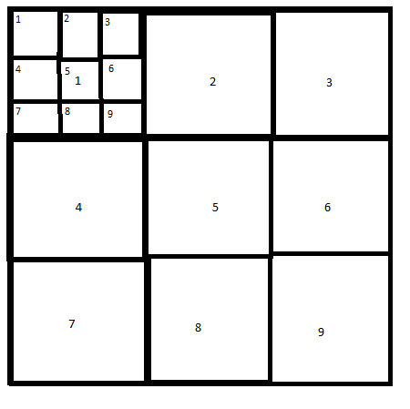
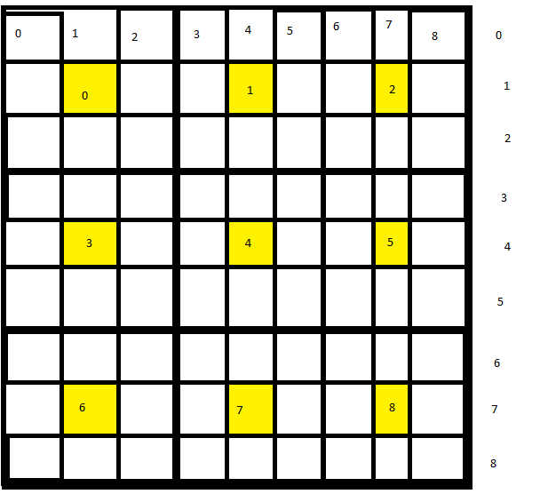

# Sudoku Game CLI

## Board Layout

The Board is made up of x amount of cells per x amount of grids. For example, a 9x9 sudoku board will be made of 9 grids of 9 cells. Where grid and board have the same layout

Fig 1: Grid - Board Layout

Fig 2: Row-Board Layout
